# PRODUCT REQUIREMENT DOCUMENT (PRD)
## APLIKASI 8: SISTEM ADMINISTRASI DESA/KELURAHAN (SADEKA)

| Proyek | Sistem Administrasi Desa/Kelurahan (SADEKA) |
| --- | --- |
| **Versi** | 1.0.0 |
| **Tanggal** | 15 Juli 2026 |
| **Status** | Draf - Menunggu Persetujuan |
| **Pembuat** | Senior Product Manager & Tech Lead |
| **Target Audiens** | Tim Pengembang, Kepala Desa/Lurah, Staf Desa, Warga Desa |

---

## 1. RINGKASAN EKSEKUTIF & VISI PRODUK

### 1.1 Latar Belakang
Administrasi desa/kelurahan di Indonesia sering kali masih dihadapi oleh tantangan klasik: pencatatan data kependudukan manual yang rentan kesalahan, proses pengurusan surat keterangan yang lambat dan memakan waktu (warga harus bolak-balik ke kantor desa), serta kurangnya transparansi mengenai program bantuan sosial dan anggaran desa. 

Sistem Administrasi Desa/Kelurahan (SADEKA) dirancang untuk memodernisasi layanan pemerintahan tingkat paling dasar (desa/kelurahan). Dengan memanfaatkan teknologi berbasis web, SADEKA bertindak sebagai *single source of truth* untuk data kependudukan dan gerbang pelayanan publik digital yang responsif, transparan, dan efisien.

### 1.2 Pernyataan Masalah (Problem Statement)
1. **Inefisiensi Birokrasi**: Warga harus mengantre lama dan menyerahkan berkas fisik berulang kali untuk mendapatkan surat keterangan sederhana.
2. **Kualitas Data Rendah**: Data kependudukan tidak sinkron (misal: mutasi lahir, mati, pindah tidak langsung tercatat di profil keluarga).
3. **Kurangnya Transparansi**: Informasi bantuan sosial dan realisasi anggaran desa sering kali tidak tersampaikan dengan baik kepada warga.
4. **Beban Kerja Staf**: Staf desa menghabiskan terlalu banyak waktu untuk mengetik ulang draf surat keterangan secara manual menggunakan aplikasi pengolah kata standar.

### 1.3 Solusi Produk
SADEKA menyediakan platform dashboard admin terintegrasi untuk staf/kepala desa (menggunakan template modern NiceAdmin) dan portal warga berbasis web untuk mengajukan surat, melihat status bantuan sosial, serta menyampaikan pengaduan secara mandiri.

### 1.4 Indikator Kinerja Utama (KPI Keberhasilan)
- **Waktu Layanan**: Memotong waktu pembuatan surat keterangan dari rata-rata 1–2 hari menjadi kurang dari 15 menit (jika pejabat berwenang berada di tempat atau melalui TTE/QR Approval).
- **Akurasi Data**: Redundansi data kependudukan berkurang hingga 95% melalui integrasi nomor Kartu Keluarga dan NIK.
- **Kepuasan Warga**: Penilaian indeks kepuasan pelayanan desa meningkat ke angka minimal 4.0/5.0.

---

## 2. STAKEHOLDER & PERSONA PENGGUNA

Sistem ini melayani 4 tipe pengguna utama:

| Peran (Role) | Deskripsi | Tanggung Jawab Utama | Kebutuhan Utama |
| --- | --- | --- | --- |
| **Superadmin** | Tim IT / Administrator Sistem | Pemeliharaan sistem, konfigurasi awal, backup database, manajemen akun staf desa. | Kontrol penuh sistem, log aktivitas, konfigurasi variabel global. |
| **Kepala Desa / Lurah** | Pejabat pengambil keputusan tertinggi | Melakukan persetujuan (approval) surat permohonan warga, memantau analitik kependudukan dan pengaduan. | Dashboard eksekutif yang ringkas, notifikasi surat masuk, fitur tanda tangan digital/QR Code approval. |
| **Staf / Operator Desa** | Pelaksana administrasi harian | Verifikasi berkas warga, pemutakhiran data kependudukan, penginputan data mutasi, pengelolaan berita desa. | Fitur pencarian kependudukan yang cepat, otomatisasi pengisian draf surat, manajemen status pengaduan. |
| **Warga Desa** | Penerima layanan | Mengajukan surat secara online, mengecek status penerimaan bansos, mengajukan pengaduan infrastruktur/pelayanan. | Tampilan yang ramah pengguna seluler, pelacakan status permohonan surat secara real-time, kemudahan unggah berkas syarat. |

---

## 3. KEBUTUHAN FUNGSIONAL & FITUR UTAMA

Fitur SADEKA dibagi ke dalam 6 modul utama dengan prioritas berdasarkan kerangka kerja MoSCoW (*Must have*, *Should have*, *Could have*, *Won't have*).

```
   ┌────────────────────────────────────────────────────────────────────────┐
   │                                SADEKA                                  │
   └───────────────────────────────────┬────────────────────────────────────┘
                                       │
         ┌───────────────┬─────────────┼─────────────┬───────────────┬───────────────┐
         ▼               ▼             ▼             ▼               ▼               ▼
   Kependudukan   Surat-Menyurat    Bansos       Pengaduan       Publikasi   Arsip & Inventaris
```

### 3.1 Modul 1: Manajemen Kependudukan (Must Have)
- **Sensus Kependudukan**: CRUD data penduduk (NIK, Nama, Tempat/Tanggal Lahir, Status Pernikahan, Pekerjaan, dll).
- **Manajemen Kartu Keluarga (KK)**: Pengelompokan penduduk berdasarkan nomor KK dengan penetapan Kepala Keluarga yang jelas. Relasi data dinamis ketika anggota keluarga ditambah atau dikurangi.
- **Mutasi Kependudukan**: Pencatatan mutasi penduduk lahir, meninggal, pindah masuk, dan pindah keluar. Penduduk yang meninggal atau pindah keluar akan secara otomatis diubah status keaktifannya menjadi 'Non-aktif' namun datanya tetap dipertahankan untuk kepentingan arsip sejarah.

### 3.2 Modul 2: Sistem Surat-Menyurat Digital (Must Have)
- **Pengajuan Mandiri & Operator**: Warga dapat mengajukan permohonan surat secara online atau staf menginputkan permohonan yang datang langsung ke kantor desa.
- **Jenis Surat yang Didukung**:
  1. Surat Keterangan Usaha (SKU)
  2. Surat Keterangan Tidak Mampu (SKTM)
  3. Surat Keterangan Domisili (SKD)
  4. Surat Keterangan Kematian
  5. Surat Pengantar Kelakuan Baik (SKCK)
- **Alur Kerja Persetujuan (Approval Workflow)**:
  1. **Draft/Pengajuan**: Permohonan masuk ke antrean operator desa.
  2. **Verifikasi**: Operator memeriksa kelengkapan berkas pendukung (KTP/KK terunggah). Jika tidak lengkap, status diubah menjadi *Ditolak* dengan catatan alasan penolakan.
  3. **Persetujuan (Signature Ready)**: Kepala Desa/Lurah menerima notifikasi permohonan terverifikasi dan memberikan persetujuan akhir.
  4. **Output PDF & QR Code**: Sistem menghasilkan PDF surat resmi lengkap dengan QR Code unik sebagai tanda tangan elektronik (TTE) verifikasi keaslian.
- **Pelacakan Status**: Warga dapat melihat status surat mereka (Draft -> Diverifikasi -> Disetujui/Ditolak).

### 3.3 Modul 3: Portal Bantuan Sosial (Should Have)
- **Pendataan Program Bansos**: Input program bantuan sosial aktif (PKH, BLT Dana Desa, Bansos Sembako, dll) beserta tahun anggaran dan deskripsinya.
- **Pemetaan Penerima**: Menghubungkan NIK warga ke program bansos terkait.
- **Validasi Kelayakan**: Membantu memfilter warga yang layak berdasarkan status pekerjaan atau klaster ekonomi untuk menghindari penumpukan bantuan pada warga yang sama (transparansi penyaluran).

### 3.4 Modul 4: Pengaduan & Aspirasi Warga (Should Have)
- **Pelaporan Masalah**: Warga dapat melaporkan masalah di lingkungan (jalan rusak, lampu jalan mati, pungli, dll) dengan mengunggah foto pendukung.
- **Manajemen Tanggapan**: Staf desa dapat mengubah status pengaduan (Pending -> Diproses -> Selesai) dan memberikan tanggapan/solusi tertulis yang dapat dibaca oleh pelapor.

### 3.5 Modul 5: Publikasi & Transparansi Desa (Could Have)
- **Berita & Pengumuman**: CMS sederhana bagi staf untuk menulis berita seputar kegiatan desa, penyuluhan, atau pengumuman penting.
- **Transparansi APBD**: Halaman publik untuk mengunggah ringkasan realisasi APBD Desa guna meningkatkan kepercayaan warga terhadap tata kelola keuangan desa.

### 3.6 Modul 6: Dashboard & Analitik (Must Have)
- **Visualisasi Demografi**: Grafik interaktif (jenis kelamin, kelompok usia, tingkat pendidikan, mata pencaharian) untuk mempermudah pengambilan keputusan pembangunan desa.
- **Statistik Surat**: Jumlah surat yang diproses, disetujui, dan ditolak per bulan untuk mengevaluasi kecepatan layanan staf.

### 3.7 Modul 7: Manajemen Arsip Dokumen (Should Have)
- **Digitalisasi Dokumen**: Penyimpanan dokumen resmi desa (Surat, Laporan, Notulen) secara digital dalam format PDF untuk mencegah kehilangan data fisik.
- **Pencarian Cepat**: Fasilitas pencarian dokumen berdasarkan judul, jenis dokumen, dan tanggal arsip.

### 3.8 Modul 8: Inventaris Desa (Should Have)
- **Pencatatan Aset**: Manajemen pendataan aset milik desa (Kendaraan, Peralatan Kantor, Bangunan) beserta kondisinya.
- **Penugasan Penanggung Jawab**: Melacak staf yang bertanggung jawab atas pengelolaan barang inventaris tertentu.

---

## 4. KEBUTUHAN NON-FUNGSIONAL (NON-FUNCTIONAL REQUIREMENTS)

### 4.1 Keamanan (Security)
- **Role-Based Access Control (RBAC)**: Pembatasan akses fitur yang ketat menggunakan middleware Laravel. Warga dilarang keras mengakses panel dashboard admin NiceAdmin.
- **Enkripsi Password**: Penggunaan hashing Bcrypt bawaan Laravel untuk menyimpan kata sandi pengguna.
- **Validasi QR Code**: QR Code pada surat tercetak harus merujuk ke URL validasi publik di platform SADEKA yang menampilkan metadata keaslian surat untuk mencegah pemalsuan dokumen fisik.
- **Proteksi Input**: Validasi ketat pada seluruh form input (perlindungan dari SQL Injection dan Cross-Site Scripting/XSS).

### 4.2 Performa (Performance)
- **Waktu Muat (Page Load)**: Waktu respons halaman dashboard kurang dari 2 detik dalam kondisi jaringan standar.
- **Optimasi Database**: Penerapan indexing yang tepat pada kolom pencarian utama (seperti `nik`, `no_kk`, `status_keaktifan`, dan `email`).
- **Penanganan PDF**: Pembuatan dokumen PDF menggunakan `laravel-dompdf` dioptimalkan agar tidak memakan RAM server yang besar dengan meminimalkan penggunaan gambar beresolusi tinggi di dalam template PDF.

### 4.3 Skalabilitas (Scalability)
- Skema database dirancang modular sehingga jika di masa depan ingin dikembangkan fitur baru (seperti modul inventaris desa atau sistem pembayaran PBB online), tabel baru dapat direlasikan tanpa merusak struktur inti kependudukan.

### 4.4 Usabilitas & Aksesibilitas (Usability & Accessibility)
- **Desain Responsif**: Antarmuka dashboard admin menggunakan NiceAdmin (Bootstrap 5) yang fully-responsive, memudahkan staf mengelola data melalui tablet atau smartphone saat bertugas di lapangan.
- **Lokalisasi**: Seluruh teks antarmuka menggunakan Bahasa Indonesia formal yang mudah dipahami oleh staf dan warga lintas generasi.

---

## 5. SKEMA DATA & ARSITEKTUR

Desain basis data SADEKA berpusat pada entitas warga (`wargas`) yang bertindak sebagai poros utama dari seluruh transaksi data dalam sistem.

### 5.1 Penjelasan Naratif Relasi Data
1. **Tabel `users` dan `wargas`**:
   - Relasi One-to-One opsional (`users.id` -> `wargas.user_id`). Tidak semua warga memiliki akun login SADEKA. Namun, setiap warga yang ingin mengajukan surat online atau menulis pengaduan secara mandiri wajib memiliki akun di tabel `users` yang ditautkan ke data profil kependudukannya di tabel `wargas`.
2. **Tabel `kartu_keluargas` dan `wargas`**:
   - Relasi One-to-Many (`kartu_keluargas.id` -> `wargas.kartu_keluarga_id`). Satu Kartu Keluarga (KK) dapat memiliki banyak anggota keluarga (warga). 
   - Relasi One-to-One terbalik (`wargas.id` -> `kartu_keluargas.kepala_keluarga_id`). Setiap Kartu Keluarga menunjuk tepat satu warga aktif sebagai Kepala Keluarga.
3. **Tabel `wargas` dan `surat_permohonans`**:
   - Relasi One-to-Many (`wargas.id` -> `surat_permohonans.warga_id`). Satu orang warga dapat mengajukan permohonan surat berulang kali sepanjang waktu.
   - Relasi tambahan ke tabel `users` (`users.id` -> `surat_permohonans.pengaju_id` dan `users.id` -> `surat_permohonans.disetujui_oleh`). Hal ini merekam jejak siapa operator yang menginputkan/mengajukan surat dan siapa pejabat (Kades/Lurah) yang menyetujuinya.
4. **Tabel `wargas` dan `mutasi_penduduks`**:
   - Relasi One-to-Many (`wargas.id` -> `mutasi_penduduks.warga_id`). Mencatat histori mutasi kependudukan yang dialami oleh warga bersangkutan.
5. **Tabel `wargas` dan `pengaduans`**:
   - Relasi One-to-Many (`wargas.id` -> `pengaduans.warga_id`). Menampung aspirasi dan keluhan warga. Diisi `NULL` jika warga memilih opsi anonim saat mengirimkan pengaduan.
   - Relasi Tanggapan (`users.id` -> `pengaduans.tanggapan_oleh`) merekam staf yang memberikan tanggapan resmi atas pengaduan tersebut.
6. **Tabel `bantuan_sosials`, `penerima_bantuans`, dan `wargas`**:
   - Relasi Many-to-Many dijembatani oleh tabel penghubung `penerima_bantuans`. Satu program bansos memiliki banyak warga penerima bantuan, dan sebaliknya satu warga dapat terdaftar di lebih dari satu program bansos yang berbeda (misal: PKH dan KIP).
7. **Tabel `users` dan `beritas`**:
   - Relasi One-to-Many (`users.id` -> `beritas.penulis_id`). Setiap berita/pengumuman ditulis dan dipublikasikan oleh staf desa yang terautentikasi dalam sistem.
8. **Tabel `users` dan `arsip_dokumens`**:
   - Relasi One-to-Many (`users.id` -> `arsip_dokumens.diarsipkan_oleh`). Mencatat siapa staf yang melakukan pengarsipan dokumen.
9. **Tabel `users` dan `inventaris_desas`**:
   - Relasi One-to-Many (`users.id` -> `inventaris_desas.penanggung_jawab_id`). Menunjuk staf atau pejabat desa yang bertanggung jawab atas aset tertentu.

### 5.2 Visualisasi ERD (Mermaid Diagram)

Berikut adalah visualisasi Entity Relationship Diagram (ERD) dari SADEKA:

```mermaid
erDiagram
    USERS ||--o| WARGA : "ditautkan_ke"
    KARTU_KELUARGA ||--o{ WARGA : "memiliki_anggota"
    KARTU_KELUARGA ||--o| WARGA : "dikepalai_oleh"
    WARGA ||--o{ SURAT_PERMOHONAN : "mengajukan"
    USERS ||--o{ SURAT_PERMOHONAN : "memasukkan_draf"
    USERS ||--o{ SURAT_PERMOHONAN : "menyetujui"
    WARGA ||--o{ MUTASI_PENDUDUK : "mengalami"
    WARGA ||--o{ PENGADUAN : "melaporkan"
    USERS ||--o{ PENGADUAN : "menanggapi"
    BANTUAN_SOSIAL ||--o{ PENERIMA_BANTUAN : "memiliki_program"
    WARGA ||--o{ PENERIMA_BANTUAN : "menerima"
    USERS ||--o{ BERITA : "menulis"
    USERS ||--o{ ARSIP_DOKUMEN : "mengarsipkan"
    USERS ||--o{ INVENTARIS_DESA : "bertanggung_jawab_atas"

    USERS {
        bigint id PK
        string name
        string email UK
        timestamp email_verified_at
        string password
        string avatar
        string role "Superadmin, Admin (Kades, Staf, Warga)"
        string remember_token
        timestamp created_at
        timestamp updated_at
    }

    WARGA {
        bigint id PK
        bigint kartu_keluarga_id FK "nullable"
        string nik UK "16_karakter"
        string nama
        string tempat_lahir
        date tanggal_lahir
        enum jenis_kelamin "Laki-laki, Perempuan"
        string agama
        enum status_perkawinan "Belum_Kawin, Kawin, Cerai_Hidup, Cerai_Mati"
        string pekerjaan
        text alamat
        string rt "3_karakter"
        string rw "3_karakter"
        string dusun
        enum status_hubungan_keluarga "Kepala_Keluarga, Suami, Istri, Anak, Lainnya"
        enum status_keaktifan "Aktif, Meninggal, Pindah"
        bigint user_id FK "nullable"
        timestamp created_at
        timestamp updated_at
    }

    KARTU_KELUARGA {
        bigint id PK
        string no_kk UK "16_karakter"
        bigint kepala_keluarga_id FK "nullable"
        text alamat
        string rt
        string rw
        string dusun
        string kode_pos
        timestamp created_at
        timestamp updated_at
    }

    SURAT_PERMOHONAN {
        bigint id PK
        string nomor_surat "nullable"
        enum jenis_surat "SKU, SKTM, SKD, SK_Kematian, SK_Pindah, Surat_Pengantar"
        bigint warga_id FK
        bigint pengaju_id FK "users_id_pengaju"
        text keperluan
        text keterangan_tambahan "nullable"
        enum status "Draft, Ditinjau_Staf, Menunggu_Tanda_Tangan, Disetujui, Ditolak"
        text catatan_penolakan "nullable"
        timestamp tanggal_pengajuan
        timestamp tanggal_persetujuan "nullable"
        bigint disetujui_oleh FK "users_id_kades_atau_lurah, nullable"
        string file_surat "path_pdf, nullable"
        string qr_code_token UK "verification_token, nullable"
        timestamp created_at
        timestamp updated_at
    }

    MUTASI_PENDUDUK {
        bigint id PK
        bigint warga_id FK
        enum jenis_mutasi "Lahir, Meninggal, Masuk, Keluar"
        date tanggal_mutasi
        text keterangan
        timestamp created_at
        timestamp updated_at
    }

    PENGADUAN {
        bigint id PK
        bigint warga_id FK "nullable_for_anonymous"
        string judul
        text isi_laporan
        enum kategori "Infrastruktur, Keamanan, Sosial, Kebersihan, Lainnya"
        string foto "nullable"
        enum status "Pending, Diproses, Selesai, Ditolak"
        text tanggapan "nullable"
        bigint tanggapan_oleh FK "users_id_staf, nullable"
        timestamp created_at
        timestamp updated_at
    }

    BANTUAN_SOSIAL {
        bigint id PK
        string nama_program "e.g._PKH,_BLT"
        text deskripsi
        string sumber_dana "e.g._APBD,_APBN"
        int tahun
        timestamp created_at
        timestamp updated_at
    }

    PENERIMA_BANTUAN {
        bigint id PK
        bigint bantuan_sosial_id FK
        bigint warga_id FK
        enum status_penerimaan "Aktif, Ditangguhkan, Diberhentikan"
        text keterangan "nullable"
        timestamp created_at
        timestamp updated_at
    }

    BERITA {
        bigint id PK
        string judul
        string slug UK
        longtext konten
        string kategori
        string gambar "nullable"
        bigint penulis_id FK "users_id_staf"
        enum status "Draft, Published"
        timestamp created_at
        timestamp updated_at
    }

    ARSIP_DOKUMEN {
        bigint id PK
        string judul
        string jenis_dokumen "Surat, Laporan, Notulen, dll"
        string file_path "lokasi_file_pdf"
        bigint diarsipkan_oleh FK "users_id"
        timestamp tanggal_arsip
        text keterangan "nullable"
        timestamp created_at
        timestamp updated_at
    }

    INVENTARIS_DESA {
        bigint id PK
        string nama_item
        string kategori "Kendaraan, Peralatan, Bangunan, dll"
        int jumlah
        string kondisi "Baik, Rusak Ringan, Rusak Berat"
        string lokasi
        bigint penanggung_jawab_id FK "users_id"
        timestamp tanggal_pencatatan
        text keterangan "nullable"
        timestamp created_at
        timestamp updated_at
    }
```



---

## 6. ARSITEKTUR TEKNIS & INTEGRASI

SADEKA dikembangkan dengan stack teknologi modern, teruji, dan mudah dipelihara:

- **Bahasa Pemrograman & Framework**: PHP 8.3 & Laravel 13 (versi terbaru yang stabil, memberikan performa tinggi dan fitur keamanan terdepan).
- **Basis Data**: SQLite (default untuk instalasi lokal yang cepat) dengan fleksibilitas migrasi penuh ke MySQL/MariaDB atau PostgreSQL untuk lingkungan produksi skala besar.
- **Antarmuka Pengguna (UI/UX)**:
  - **Framework CSS**: Bootstrap 5 + Vanilla CSS (kustomisasi warna dinamis di satu tempat via CSS Variables).
  - **Admin Template**: **NiceAdmin**, menyediakan antarmuka dashboard profesional dengan tata letak sidebar, header, card widget, dan form input yang elegan.
- **Pustaka Utama (Key Libraries)**:
  - **Laravel DomPDF** (`barryvdh/laravel-dompdf`): Mengonversi template Blade HTML menjadi dokumen PDF resmi secara dinamis.
  - **DataTables**: Grid data interaktif dengan pencarian instan, filter, dan pagination untuk mengelola ribuan data warga tanpa membebani browser.
  - **SweetAlert2**: Notifikasi popup yang interaktif dan modern untuk konfirmasi aksi sensitif (seperti menghapus data warga atau menolak surat).
  - **Select2**: Dropdown dinamis dengan fitur pencarian teks, sangat berguna untuk memilih NIK warga pada form surat atau bansos.
  - **TinyMCE WYSIWYG Editor**: Text editor kaya fitur untuk menyusun berita/publikasi desa dengan penyisipan teks tebal, miring, dan gambar.

---

## 7. ALUR KERJA UTAMA (KEY WORKFLOWS)

### 7.1 Alur Kerja Pengajuan & Penerbitan Surat

```
Warga/Staf           Staf (Operator)            Kepala Desa            Sistem SADEKA
   │                        │                        │                        │
   ├─► Ajukan Surat ────────┼────────────────────────┼───────────────────────┐│
   │   (Isi Form)           │                        │                       ││
   │                        │                        │                       ▼│
   │                        │                        │               Status: DITINJAU
   │                        ├─► Verifikasi Berkas ───┼───────────────────────┐│
   │                        │   (Valid/Tidak)        │                       ││
   │                        │                        │                       ▼│
   │                        │                        │               Status: MENUNGGU_TTE
   │                        │                        ├─► Setujui Surat ──────┐│
   │                        │                        │   (E-Signature)       ││
   │                        │                        │                       ▼│
   │                        │                        │               Generate PDF + QR
   │                        │                        │               Status: DISETUJUI
   │◄───────────────────────┴────────────────────────┴───────────────────────┤│
   │   Unduh PDF Surat                                                       ││
   ▼                                                                         ▼
```

1. **Pengajuan**: Warga masuk ke portal SADEKA, memilih jenis surat, mengisi formulir keperluan, dan mengunggah dokumen persyaratan (misal: foto KK).
2. **Peninjauan**: Operator desa menerima notifikasi di dashboard admin. Operator memverifikasi kesesuaian data input dengan basis data kependudukan SADEKA.
   - Jika berkas tidak valid, operator menolak pengajuan dan memberikan catatan alasan penolakan (misal: "Dokumen KK buram"). Status berubah menjadi *Ditolak*.
   - Jika berkas valid, operator meneruskan pengajuan ke Kepala Desa. Status berubah menjadi *Menunggu Tanda Tangan*.
3. **Persetujuan**: Kepala Desa melihat daftar surat yang menunggu persetujuan pada dashboard-nya. Kepala Desa mengklik tombol "Setujui".
4. **Penerbitan**: Sistem secara otomatis:
   - Membuat nomor surat resmi berdasarkan penomoran urut otomatis desa.
   - Membuat token verifikasi unik dan menghasilkan QR Code.
   - Mengompilasi template HTML Blade surat menjadi PDF dengan menempelkan QR Code di bagian tanda tangan.
   - Mengubah status permohonan menjadi *Disetujui* dan menyimpan file PDF ke *storage*.
5. **Pengambilan**: Warga mendapatkan notifikasi bahwa surat telah selesai dan dapat mengunduh dokumen PDF secara langsung dari portal warga atau mencetaknya secara mandiri.

---

## 8. RENCANA IMPLEMENTASI & RILIS

Untuk memastikan kualitas dan penyelesaian tepat waktu, pengembangan SADEKA dibagi menjadi 5 fase utama:

```
┌──────────────────┐     ┌──────────────────┐     ┌──────────────────┐
│ FASE 1           │     │ FASE 2           │     │ FASE 3           │
│ Setup & Auth     ├────►│ Kependudukan     ├────►│ Surat-Menyurat   │
│ (Minggu 1)       │     │ (Minggu 2)       │     │ (Minggu 3-4)     │
└──────────────────┘     └──────────────────┘     └──────────────────┘
                                                           │
                                                           ▼
┌──────────────────┐     ┌──────────────────┐     ┌──────────────────┐
│ FASE 5           │     │ FASE 4           │     │                  │
│ Rilis & UAT      │◄────┤ Bansos & Aduan   │◄────┘                  │
│ (Minggu 6)       │     │ (Minggu 5)       │     │                  │
└──────────────────┘     └──────────────────┘     └──────────────────┘
```

- **Fase 1: Setup Dasar & Autentikasi (Minggu 1)**
  - Inisialisasi proyek Laravel 13, integrasi template NiceAdmin.
  - Setup tabel `users` dan RBAC middleware (Superadmin, Kepala Desa, Staf, Warga).
  - Integrasi fitur Profil Pengguna dan Pengaturan Aplikasi global.
- **Fase 2: Modul Kependudukan & Mutasi (Minggu 2)**
  - Migrasi skema tabel `kartu_keluargas`, `wargas`, dan `mutasi_penduduks`.
  - Halaman CRUD Kartu Keluarga dan Anggota Keluarga lengkap dengan filter pencarian DataTables.
  - Form pencatatan mutasi penduduk (Lahir, Mati, Pindah).
- **Fase 3: Modul Surat-Menyurat & PDF Generator (Minggu 3-4)**
  - Migrasi skema tabel `surat_permohonans`.
  - Pembuatan form pengajuan surat dinamis (menggunakan Select2 untuk relasi warga).
  - Alur approval berjenjang (Operator -> Kepala Desa).
  - Integrasi `laravel-dompdf` dan generator QR Code verifikasi.
- **Fase 4: Modul Bansos, Pengaduan, Publikasi & Ekstra (Minggu 5)**
  - Migrasi skema tabel `bantuan_sosials`, `penerima_bantuans`, `pengaduans`, `beritas`, `arsip_dokumens`, dan `inventaris_desas`.
  - Halaman manajemen bansos & pemetaan penerima manfaat.
  - Form pengaduan warga dengan fitur unggah bukti foto dan sistem respons dari staf.
  - CMS Berita dengan TinyMCE Editor.
  - CRUD manajemen Arsip Dokumen Digital dan Inventaris Aset Desa.
- **Fase 5: Dashboard Analitis, UAT, & Deployment (Minggu 6)**
  - Implementasi widget dan grafik analitik kependudukan pada dashboard admin (Chart.js / ApexCharts bawaan NiceAdmin).
  - Pengujian fungsionalitas menyeluruh (Unit & Feature Testing menggunakan Pest).
  - User Acceptance Testing (UAT) bersama perangkat desa.
  - Deployment aplikasi ke server production (VPS Linux dengan web server Nginx/Apache dan MySQL).
